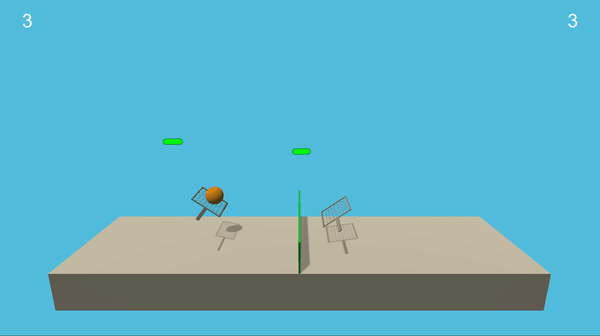

# Multi-Agent collaboration and competition

## Description
The goal of this project is to train a multi agent system. Specifically, the system consists of two agents that play tennis, each of them controlling its own racket to bounce a ball over a net.

<p align="center">
    
</p>

## Problem Statement
Once agent hits the ball over the net, it receives a reward of +0.1. If an agent lets a ball hit the ground or hits the ball out of bounds, it receives a reward of -0.01. Thus, the goal of each agent is to keep the ball in play.

The observation space consists of 8 variables corresponding to the position and velocity of the ball and racket. Each agent receives its own, local observation. Two continuous actions are available, corresponding to movement towards (or away from) the net, and jumping.

The task is episodic. In order to solve the environment, the agents must get an average score of +0.5 over certain amount (100) of consecutive episodes, where each episodic score is calculated by taking the maximum of both agents.

## Files
- `Tennis.ipynb`: notebook containing the runnable solution, **entry point**
- `ddpg.py`: implementation of the DDPG agent class
- `multiagent.py`: implementation of the wrapper class over multiple agents
- `neural_models.py`: implementation of the actor and the critic classes
- `mem_buffers.py`: implementation of the replay memory buffer (currently one version)
- `noise_model.py`: implementation of the noise model (Ornstein-Uhlenbeck process)
- `checkpoint_critic_agent_{i}.pth`: saved model for the critic of the i-th agent
- `checkpoint_actor_agent_{i}.pth`: saved model for the actor of the i-th agent

## Dependencies
Code has been implemented in python 3,
the other dependencies are listed in the `requirements.txt` file. Install them with the following command:

```
pip install requirements.txt
```

Furthermore, you need to download the Unity ML Agents environment from one of the links below. Select the one matching your operating system:
- Linux: [click here](https://s3-us-west-1.amazonaws.com/udacity-drlnd/P3/Tennis/Tennis_Linux.zip)
- Mac OSX: [click here](https://s3-us-west-1.amazonaws.com/udacity-drlnd/P3/Tennis/Tennis.app.zip)
- Windows (32-bit): [click here](https://s3-us-west-1.amazonaws.com/udacity-drlnd/P3/Tennis/Tennis_Windows_x86.zip)
- Windows (64-bit): [click here](https://s3-us-west-1.amazonaws.com/udacity-drlnd/P3/Tennis/Tennis_Windows_x86_64.zip)

Place the file in the root project location, decompress the file and then update the path argument for creating the environment in `Tennis.ipynb`:

Example for Mac OS:
```python
env = UnityEnvironment(file_name="Tennis.app")
```

## Execution
Run the cells in the notebook `Tennis.ipynb` to train the multiagent system.

## Implementations
Repository contains implementation inspired by the idea of Multi-Agent Actor-Critic for Mixed Cooperative-Competitive Environments:

- MADDPG [[Paper](https://arxiv.org/abs/1706.02275)]

## Results
Plot shows the scores over all episodes of training. Green line signifies the required threshold of running average of the scores (frame of size 100).


